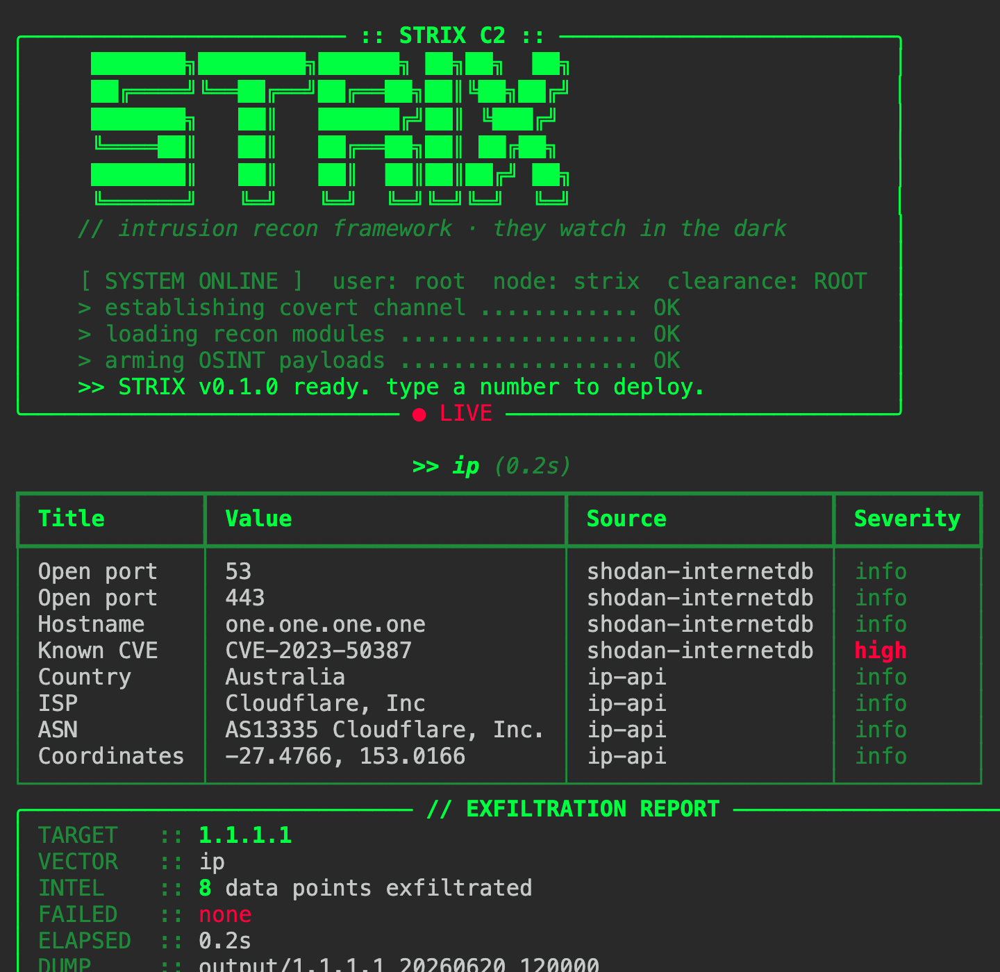

```
   ███████╗████████╗██████╗ ██╗██╗  ██╗
   ██╔════╝╚══██╔══╝██╔══██╗██║╚██╗██╔╝
   ███████╗   ██║   ██████╔╝██║ ╚███╔╝
   ╚════██║   ██║   ██╔══██╗██║ ██╔██╗
   ███████║   ██║   ██║  ██║██║██╔╝ ██╗
   ╚══════╝   ╚═╝   ╚═╝  ╚═╝╚═╝╚═╝  ╚═╝
        OSINT Orchestrator · they watch in the dark
```

# STRIX

[](LICENSE)
[](https://www.python.org/)
[](https://github.com/paulolvrlct/strix/actions/workflows/ci.yml)
[](Dockerfile)

STRIX is an OSINT orchestrator that is **passive by default**. It aggregates many
open-source intelligence sources (username, email, domain, IP, phone, image, file,
crypto wallet) behind a single CLI and produces a unified, timestamped report
(JSON + Markdown + branded HTML). **No API key is required** for the core features.
Active modules (e.g. port scanning) exist but are **opt-in** and gated behind an
explicit authorization flag — see [Legal / Ethical use](#legal--ethical-use).

The value is not in reinventing existing tools — it is in **orchestration,
correlation and clean reporting**. STRIX calls proven tools (Maigret, Holehe) and
free public APIs (crt.sh, Shodan InternetDB, DNS, ip-api), normalizes everything
into a common schema, and emits an actionable deliverable.

## Features

- **Single CLI** over eight target types: username, email, domain, IP, phone, image, file, wallet.
- **Interactive menu**: run `strix` with no arguments for a numbered, navigable multitool.
- **File & image forensics**: EXIF/metadata + GPS via ExifTool (images, PDF, Office, media).
- **Crypto wallet lookup**: BTC/ETH balance and activity via public chain APIs (no key).
- **Dorking engine**: ready-to-click Google/Bing/DuckDuckGo dork URLs for a target.
- **Passive by default**; optional **active** modules (port scan) are opt-in (`--active`) and authorization-gated.
- **No API key required** for core modules (optional keys enable richer results).
- **Async orchestration** with bounded concurrency and per-module rate limiting.
- **Unified report** in JSON (source of truth), Markdown, and branded HTML.
- **Plugin architecture** — add a source by dropping one file into `modules/`.
- **Docker-first**, hardened non-root image.

## Demo

> Placeholders — replace with real captures.



## Modules

| Module   | Target type        | Sources                          | API key | Mode    |
|----------|--------------------|----------------------------------|---------|---------|
| username | username           | Maigret                          | no      | passive |
| email    | email              | Holehe                           | no      | passive |
| domain   | domain             | crt.sh, DNS (dnspython), WHOIS   | no      | passive |
| ip       | ip                 | Shodan InternetDB, ip-api        | no      | passive |
| phone    | phone              | phonenumbers (offline)           | no      | passive |
| image    | image              | ExifTool (metadata + GPS)        | no      | passive |
| file     | file               | ExifTool (PDF/Office/media)      | no      | passive |
| wallet   | wallet             | blockstream.info, blockchair     | no      | passive |
| dorking  | domain/user/email  | Google/Bing/DuckDuckGo URLs      | no      | passive |
| portscan | ip, domain         | TCP connect scan                 | no      | active  |

## Installation

### Docker (recommended)

```bash
docker compose build
docker compose run --rm strix scan example.com --i-am-authorized
```

### Local (virtualenv)

```bash
python3.12 -m venv .venv
source .venv/bin/activate
pip install -e .
strix version
```

Some modules shell out to system binaries (already bundled in the Docker image).
For local runs install them with your package manager:

```bash
# macOS
brew install exiftool whois
# Debian/Ubuntu
sudo apt install libimage-exiftool-perl whois
```

`maigret` and `holehe` are installed via pip (`pip install -e .`); `exiftool` and
`whois` are system tools. Each module degrades gracefully if its binary is absent.

## Usage

### Interactive menu (multitool)

Run with no arguments to get a numbered menu: pick a scan, type the target, and it
runs — then returns to the menu. Quit with `0`.

```bash
strix                                  # local
docker compose run --rm strix          # Docker (TTY allocated automatically)
# or explicitly:
strix menu
```

### Direct commands

```bash
strix username paulx                 # single source-type
strix email user@example.com
strix domain example.com
strix ip 1.1.1.1
strix phone "+33612345678"
strix image photo.jpg                 # EXIF metadata + GPS (local file or URL)
strix file report.pdf                 # metadata of any document/media file
strix wallet 1A1zP1eP5QGefi2DMPTfTL5SLmv7DivfNa   # BTC/ETH balance & activity
strix dork example.com                # search-engine dork URLs
strix port 1.1.1.1 --i-am-authorized  # ACTIVE TCP port scan (authorized only)
strix scan example.com --i-am-authorized          # auto-detect, run passive modules
strix scan 1.1.1.1 --active --i-am-authorized      # also run active modules (port scan)
strix modules                        # list modules (mode: passive/active)
strix version
```

Main options on scan commands:

| Option | Effect |
|---|---|
| `--type [auto\|username\|email\|domain\|ip\|phone\|image]` | force the target type (default `auto`) |
| `--output, -o PATH` | output directory (default `./output`) |
| `--format, -f` | subset of `json,md,html` (default: all three) |
| `--no-banner` | hide the ASCII banner |
| `--quiet, -q` | minimal output (useful in pipes/CI) |
| `--max-concurrency INT` | concurrency limit |
| `--active` | (scan) also run active modules such as the port scan |
| `--i-am-authorized` | acknowledge the legal warning |

## Output

```
output/<target_slug>_<YYYYMMDD_HHMMSS>/
├── report.json   # serialized Report — source of truth
├── report.md     # GitHub-readable report
├── report.html   # self-contained branded report (navy/cyan)
└── raw/          # raw outputs of external tools (when produced)
```

## Legal / Ethical use

STRIX is for **authorized security research, CTF, and education only**. You are
responsible for complying with applicable laws and platform Terms of Service.

Most modules are **passive**: they query public sources and indexed data without
touching the target. STRIX also ships **active** modules (currently a TCP port
scanner) that *do* contact the target directly. Active modules are clearly marked
`active` (see `strix modules`), are **never run by default**, and require an
explicit opt-in (`--active`, or the dedicated `strix port` command) on top of the
`--i-am-authorized` acknowledgement. **Only run active modules against systems you
own or are explicitly authorized to test.** STRIX contains no exploitation,
brute-force, credential stuffing, DoS, or payload-delivery features.

## Roadmap

- [x] Phase 0 — Scaffold (models, config, CLI skeleton, plugin registry)
- [X] Phase 1 — Core + domain/username/email modules + text report
- [X] Phase 2 — IP/phone modules + branded HTML report
- [X] Phase 3 — Docker (hardened, non-root)
- [X] Phase 4 — Tests, CI, full README, network error handling

## License

MIT — see [LICENSE](LICENSE).
